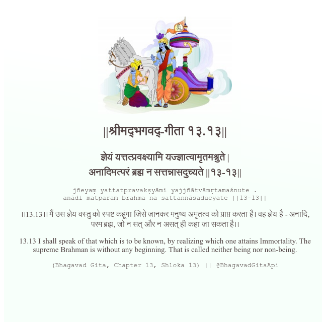

<h2>||श्रीमद्‍भगवद्‍-गीता १३.१३||</h2>
<h3>ज्ञेयं यत्तत्प्रवक्ष्यामि यज्ज्ञात्वामृतमश्नुते | अनादिमत्परं ब्रह्म न सत्तन्नासदुच्यते ||१३-१३||</h3>
<pre>jñeyaṃ yattatpravakṣyāmi yajjñātvāmṛtamaśnute . anādi matparaṃ brahma na sattannāsaducyate ||13-13||</pre>

।।13.13।। मैं उस ज्ञेय वस्तु को स्पष्ट कहूंगा जिसे जानकर मनुष्य अमृतत्व को प्राप्त करता है। वह ज्ञेय है - अनादि, परम ब्रह्म, जो न सत् और न असत् ही कहा जा सकता है।।

<pre>(Bhagavad Gita, Chapter 13, Shloka 13) || @BhagavadGitaApi</pre>
https://docs.bhagavadgitaapi.in/

#API #bhagavadgitaapi #slok #nodejs #js #api #gitaapi #krishna #hinduism #vedic #ISKCON #shreemadbhagavadgita #technology

