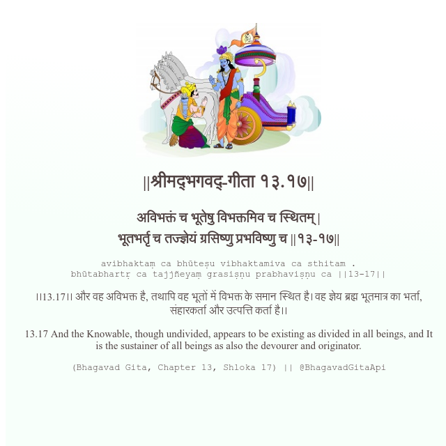

<h2>||श्रीमद्‍भगवद्‍-गीता १३.१७||</h2>
<h3>अविभक्तं च भूतेषु विभक्तमिव च स्थितम् | भूतभर्तृ च तज्ज्ञेयं ग्रसिष्णु प्रभविष्णु च ||१३-१७||</h3>
<pre>avibhaktaṃ ca bhūteṣu vibhaktamiva ca sthitam . bhūtabhartṛ ca tajjñeyaṃ grasiṣṇu prabhaviṣṇu ca ||13-17||</pre>

।।13.17।। और वह अविभक्त है, तथापि वह भूतों में विभक्त के समान स्थित है। वह ज्ञेय ब्रह्म भूतमात्र का भर्ता, संहारकर्ता और उत्पत्ति कर्ता है।।

<pre>(Bhagavad Gita, Chapter 13, Shloka 17) || @BhagavadGitaApi</pre>
https://vedicscriptures.github.io/

#API #bhagavadgitaapi #slok #nodejs #js #api #gitaapi #krishna #hinduism #vedic #ISKCON #shreemadbhagavadgita #technology

