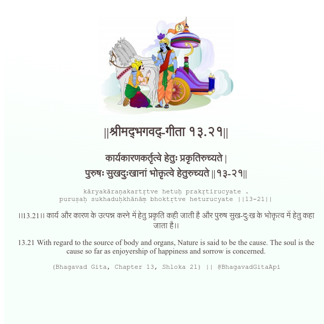

<h2>||श्रीमद्‍भगवद्‍-गीता १३.२१||</h2>
<h3>कार्यकारणकर्तृत्वे हेतुः प्रकृतिरुच्यते | पुरुषः सुखदुःखानां भोक्तृत्वे हेतुरुच्यते ||१३-२१||</h3>
<pre>kāryakāraṇakartṛtve hetuḥ prakṛtirucyate . puruṣaḥ sukhaduḥkhānāṃ bhoktṛtve heturucyate ||13-21||</pre>

।।13.21।। कार्य और कारण के उत्पन्न करने में हेतु प्रकृति कही जाती है और पुरुष सुख-दु:ख के भोक्तृत्व में हेतु कहा जाता है।।

<pre>(Bhagavad Gita, Chapter 13, Shloka 21) || @BhagavadGitaApi</pre>
https://docs.bhagavadgitaapi.in/

#API #bhagavadgitaapi #slok #nodejs #js #api #gitaapi #krishna #hinduism #vedic #ISKCON #shreemadbhagavadgita #technology

