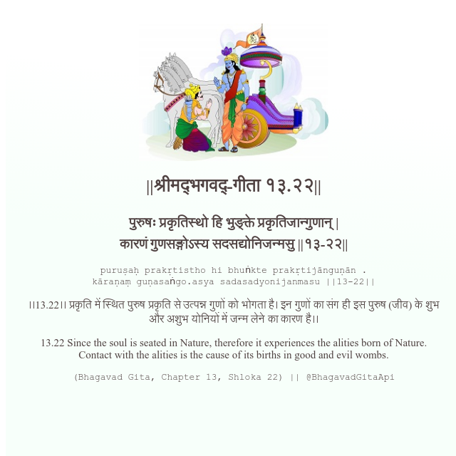

<h2>||श्रीमद्‍भगवद्‍-गीता १३.२२||</h2>
<h3>पुरुषः प्रकृतिस्थो हि भुङ्क्ते प्रकृतिजान्गुणान् | कारणं गुणसङ्गोऽस्य सदसद्योनिजन्मसु ||१३-२२||</h3>
<pre>puruṣaḥ prakṛtistho hi bhuṅkte prakṛtijānguṇān . kāraṇaṃ guṇasaṅgo.asya sadasadyonijanmasu ||13-22||</pre>

।।13.22।। प्रकृति में स्थित पुरुष प्रकृति से उत्पन्न गुणों को भोगता है। इन गुणों का संग ही इस पुरुष (जीव) के शुभ और अशुभ योनियों में जन्म लेने का कारण है।।

<pre>(Bhagavad Gita, Chapter 13, Shloka 22) || @BhagavadGitaApi</pre>
https://vedicscriptures.github.io/

#API #bhagavadgitaapi #slok #nodejs #js #api #gitaapi #krishna #hinduism #vedic #ISKCON #shreemadbhagavadgita #technology

