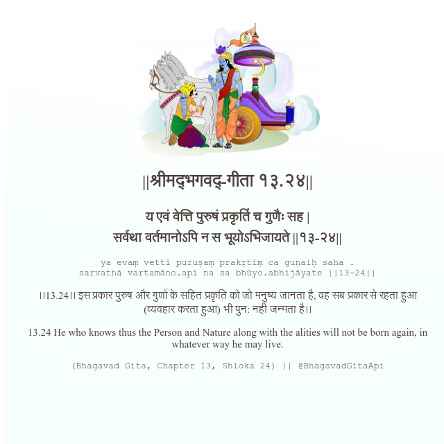

<h2>||श्रीमद्‍भगवद्‍-गीता १३.२४||</h2>
<h3>य एवं वेत्ति पुरुषं प्रकृतिं च गुणैः सह | सर्वथा वर्तमानोऽपि न स भूयोऽभिजायते ||१३-२४||</h3>
<pre>ya evaṃ vetti puruṣaṃ prakṛtiṃ ca guṇaiḥ saha . sarvathā vartamāno.api na sa bhūyo.abhijāyate ||13-24||</pre>

।।13.24।। इस प्रकार पुरुष और गुणों के सहित प्रकृति को जो मनुष्य जानता है, वह सब प्रकार से रहता हुआ (व्यवहार करता हुआ) भी पुन: नहीं जन्मता है।।

<pre>(Bhagavad Gita, Chapter 13, Shloka 24) || @BhagavadGitaApi</pre>
https://docs.bhagavadgitaapi.in/

#API #bhagavadgitaapi #slok #nodejs #js #api #gitaapi #krishna #hinduism #vedic #ISKCON #shreemadbhagavadgita #technology

