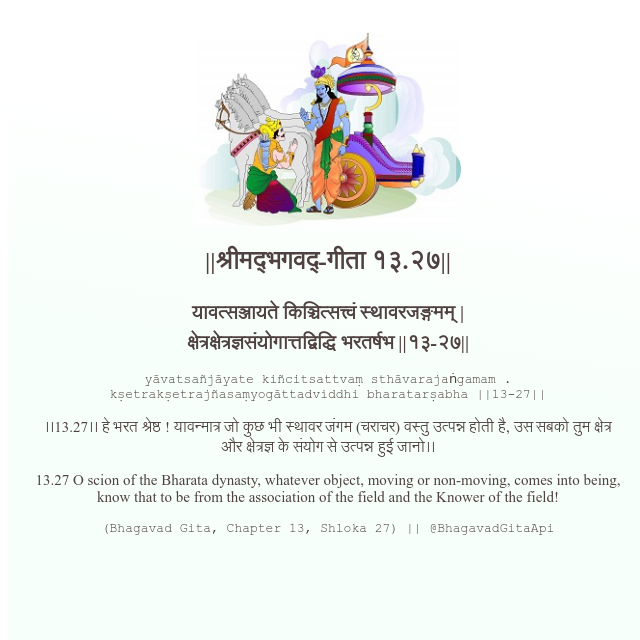

<h2>||श्रीमद्‍भगवद्‍-गीता १३.२७||</h2>
<h3>यावत्सञ्जायते किञ्चित्सत्त्वं स्थावरजङ्गमम् | क्षेत्रक्षेत्रज्ञसंयोगात्तद्विद्धि भरतर्षभ ||१३-२७||</h3>
<pre>yāvatsañjāyate kiñcitsattvaṃ sthāvarajaṅgamam . kṣetrakṣetrajñasaṃyogāttadviddhi bharatarṣabha ||13-27||</pre>

।।13.27।। हे भरत श्रेष्ठ ! यावन्मात्र जो कुछ भी स्थावर जंगम (चराचर) वस्तु उत्पन्न होती है, उस सबको तुम क्षेत्र और क्षेत्रज्ञ के संयोग से उत्पन्न हुई जानो।।

<pre>(Bhagavad Gita, Chapter 13, Shloka 27) || @BhagavadGitaApi</pre>
https://docs.bhagavadgitaapi.in/

#API #bhagavadgitaapi #slok #nodejs #js #api #gitaapi #krishna #hinduism #vedic #ISKCON #shreemadbhagavadgita #technology

