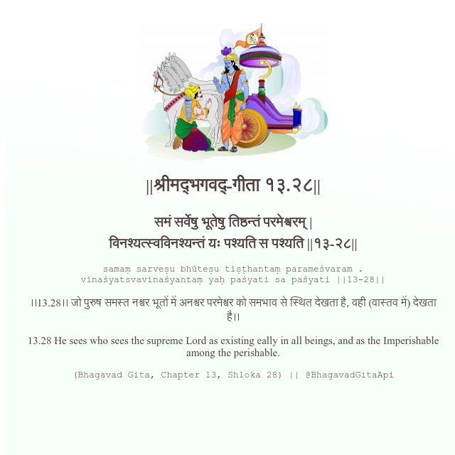

<h2>||श्रीमद्‍भगवद्‍-गीता १३.२८||</h2>
<h3>समं सर्वेषु भूतेषु तिष्ठन्तं परमेश्वरम् | विनश्यत्स्वविनश्यन्तं यः पश्यति स पश्यति ||१३-२८||</h3>
<pre>samaṃ sarveṣu bhūteṣu tiṣṭhantaṃ parameśvaram . vinaśyatsvavinaśyantaṃ yaḥ paśyati sa paśyati ||13-28||</pre>

।।13.28।। जो पुरुष समस्त नश्वर भूतों में अनश्वर परमेश्वर को समभाव से स्थित देखता है, वही (वास्तव में) देखता है।।

<pre>(Bhagavad Gita, Chapter 13, Shloka 28) || @BhagavadGitaApi</pre>
https://bhagavadgitaapi.in/

#API #bhagavadgitaapi #slok #nodejs #js #api #gitaapi #krishna #hinduism #vedic #ISKCON #shreemadbhagavadgita #technology

