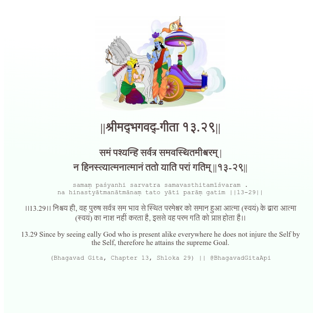

<h2>||श्रीमद्‍भगवद्‍-गीता १३.२९||</h2>
<h3>समं पश्यन्हि सर्वत्र समवस्थितमीश्वरम् | न हिनस्त्यात्मनात्मानं ततो याति परां गतिम् ||१३-२९||</h3>
<pre>samaṃ paśyanhi sarvatra samavasthitamīśvaram . na hinastyātmanātmānaṃ tato yāti parāṃ gatim ||13-29||</pre>

।।13.29।। निश्चय ही, वह पुरुष सर्वत्र सम भाव से स्थित परमेश्वर को समान हुआ आत्मा (स्वयं) के द्वारा आत्मा (स्वयं) का नाश नहीं करता है, इससे वह परम गति को प्राप्त होता है।।

<pre>(Bhagavad Gita, Chapter 13, Shloka 29) || @BhagavadGitaApi</pre>
https://bhagavadgitaapi.in/

#API #bhagavadgitaapi #slok #nodejs #js #api #gitaapi #krishna #hinduism #vedic #ISKCON #shreemadbhagavadgita #technology

