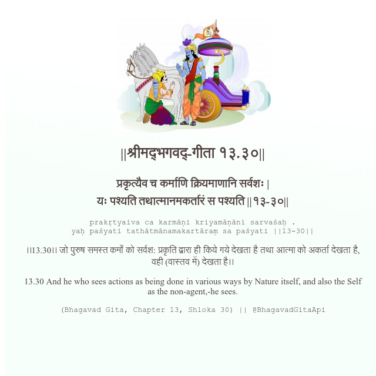

<h2>||श्रीमद्‍भगवद्‍-गीता १३.३०||</h2>
<h3>प्रकृत्यैव च कर्माणि क्रियमाणानि सर्वशः | यः पश्यति तथात्मानमकर्तारं स पश्यति ||१३-३०||</h3>
<pre>prakṛtyaiva ca karmāṇi kriyamāṇāni sarvaśaḥ . yaḥ paśyati tathātmānamakartāraṃ sa paśyati ||13-30||</pre>

।।13.30।। जो पुरुष समस्त कर्मों को सर्वश: प्रकृति द्वारा ही किये गये देखता है तथा आत्मा को अकर्ता देखता है, वही (वास्तव में) देखता है।।

<pre>(Bhagavad Gita, Chapter 13, Shloka 30) || @BhagavadGitaApi</pre>
https://vedicscriptures.github.io/

#API #bhagavadgitaapi #slok #nodejs #js #api #gitaapi #krishna #hinduism #vedic #ISKCON #shreemadbhagavadgita #technology

