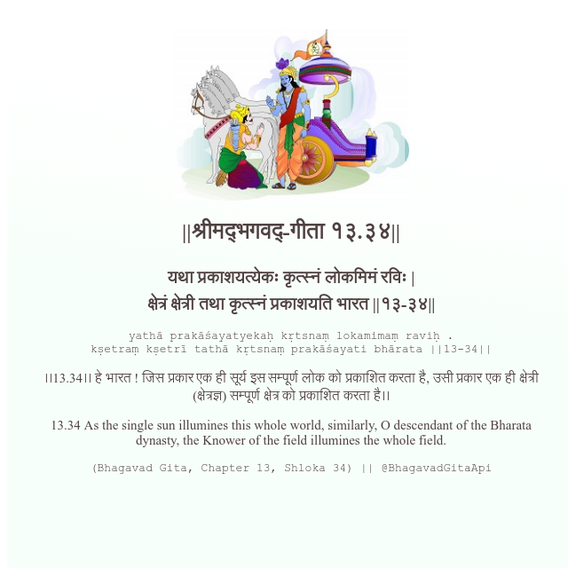

<h2>||श्रीमद्‍भगवद्‍-गीता १३.३४||</h2>
<h3>यथा प्रकाशयत्येकः कृत्स्नं लोकमिमं रविः | क्षेत्रं क्षेत्री तथा कृत्स्नं प्रकाशयति भारत ||१३-३४||</h3>
<pre>yathā prakāśayatyekaḥ kṛtsnaṃ lokamimaṃ raviḥ . kṣetraṃ kṣetrī tathā kṛtsnaṃ prakāśayati bhārata ||13-34||</pre>

।।13.34।। हे भारत ! जिस प्रकार एक ही सूर्य इस सम्पूर्ण लोक को प्रकाशित करता है, उसी प्रकार एक ही क्षेत्री (क्षेत्रज्ञ) सम्पूर्ण क्षेत्र को प्रकाशित करता है।।

<pre>(Bhagavad Gita, Chapter 13, Shloka 34) || @BhagavadGitaApi</pre>
https://vedicscriptures.github.io/

#API #bhagavadgitaapi #slok #nodejs #js #api #gitaapi #krishna #hinduism #vedic #ISKCON #shreemadbhagavadgita #technology

