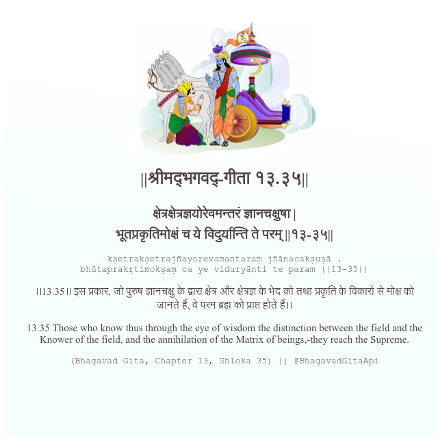

<h2>||श्रीमद्‍भगवद्‍-गीता १३.३५||</h2>
<h3>क्षेत्रक्षेत्रज्ञयोरेवमन्तरं ज्ञानचक्षुषा | भूतप्रकृतिमोक्षं च ये विदुर्यान्ति ते परम् ||१३-३५||</h3>
<pre>kṣetrakṣetrajñayorevamantaraṃ jñānacakṣuṣā . bhūtaprakṛtimokṣaṃ ca ye viduryānti te param ||13-35||</pre>

।।13.35।। इस प्रकार, जो पुरुष ज्ञानचक्षु के द्वारा क्षेत्र और क्षेत्रज्ञ के भेद को तथा प्रकृति के विकारों से मोक्ष को जानते हैं, वे परम ब्रह्म को प्राप्त होते हैं।।

<pre>(Bhagavad Gita, Chapter 13, Shloka 35) || @BhagavadGitaApi</pre>
https://docs.bhagavadgitaapi.in/

#API #bhagavadgitaapi #slok #nodejs #js #api #gitaapi #krishna #hinduism #vedic #ISKCON #shreemadbhagavadgita #technology

