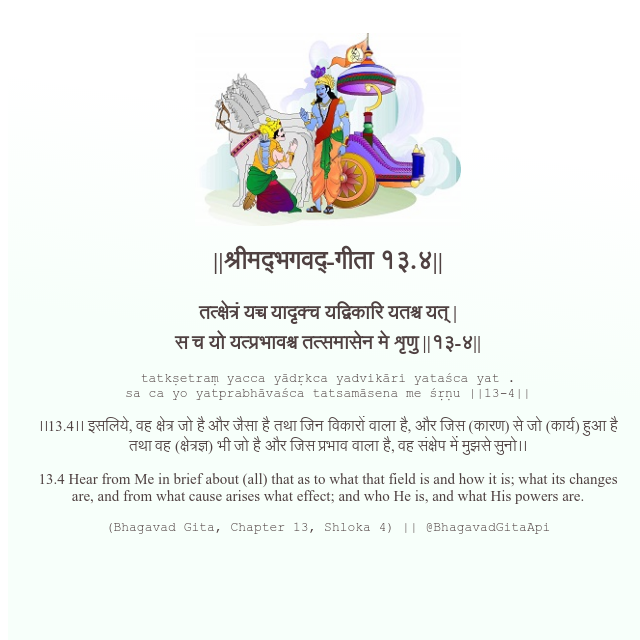

<h2>||श्रीमद्‍भगवद्‍-गीता १३.४||</h2>
<h3>तत्क्षेत्रं यच्च यादृक्च यद्विकारि यतश्च यत् | स च यो यत्प्रभावश्च तत्समासेन मे शृणु ||१३-४||</h3>
<pre>tatkṣetraṃ yacca yādṛkca yadvikāri yataśca yat . sa ca yo yatprabhāvaśca tatsamāsena me śṛṇu ||13-4||</pre>

।।13.4।। इसलिये, वह क्षेत्र जो है और जैसा है तथा जिन विकारों वाला है, और जिस (कारण) से जो (कार्य) हुआ है तथा वह (क्षेत्रज्ञ) भी जो है और जिस प्रभाव वाला है, वह संक्षेप में मुझसे सुनो।।

<pre>(Bhagavad Gita, Chapter 13, Shloka 4) || @BhagavadGitaApi</pre>
https://bhagavadgitaapi.in/

#API #bhagavadgitaapi #slok #nodejs #js #api #gitaapi #krishna #hinduism #vedic #ISKCON #shreemadbhagavadgita #technology

