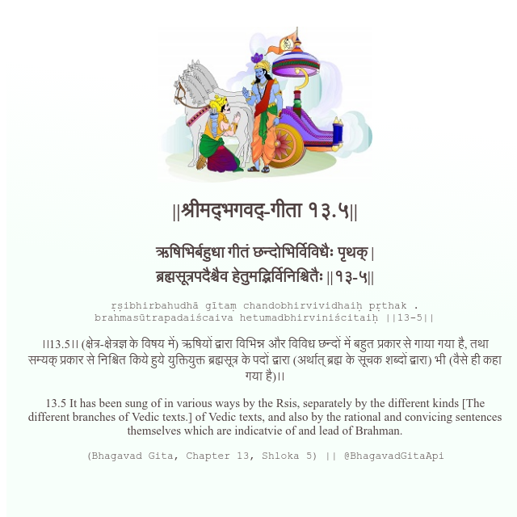

<h2>||श्रीमद्‍भगवद्‍-गीता १३.५||</h2>
<h3>ऋषिभिर्बहुधा गीतं छन्दोभिर्विविधैः पृथक् | ब्रह्मसूत्रपदैश्चैव हेतुमद्भिर्विनिश्चितैः ||१३-५||</h3>
<pre>ṛṣibhirbahudhā gītaṃ chandobhirvividhaiḥ pṛthak . brahmasūtrapadaiścaiva hetumadbhirviniścitaiḥ ||13-5||</pre>

।।13.5।। (क्षेत्र-क्षेत्रज्ञ के विषय में) ऋषियों द्वारा विभिन्न और विविध छन्दों में बहुत प्रकार से गाया गया है, तथा सम्यक् प्रकार से निश्चित किये हुये युक्तियुक्त ब्रह्मसूत्र के पदों द्वारा (अर्थात् ब्रह्म के सूचक शब्दों द्वारा) भी (वैसे ही कहा गया है)।।

<pre>(Bhagavad Gita, Chapter 13, Shloka 5) || @BhagavadGitaApi</pre>
https://vedicscriptures.github.io/

#API #bhagavadgitaapi #slok #nodejs #js #api #gitaapi #krishna #hinduism #vedic #ISKCON #shreemadbhagavadgita #technology

