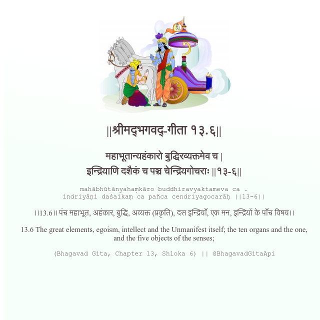

<h2>||श्रीमद्‍भगवद्‍-गीता १३.६||</h2>
<h3>महाभूतान्यहंकारो बुद्धिरव्यक्तमेव च | इन्द्रियाणि दशैकं च पञ्च चेन्द्रियगोचराः ||१३-६||</h3>
<pre>mahābhūtānyahaṃkāro buddhiravyaktameva ca . indriyāṇi daśaikaṃ ca pañca cendriyagocarāḥ ||13-6||</pre>

।।13.6।। पंच महाभूत, अहंकार, बुद्धि, अव्यक्त (प्रकृति), दस इन्द्रियाँ, एक मन, इन्द्रियों के पाँच विषय।।

<pre>(Bhagavad Gita, Chapter 13, Shloka 6) || @BhagavadGitaApi</pre>
https://docs.bhagavadgitaapi.in/

#API #bhagavadgitaapi #slok #nodejs #js #api #gitaapi #krishna #hinduism #vedic #ISKCON #shreemadbhagavadgita #technology

