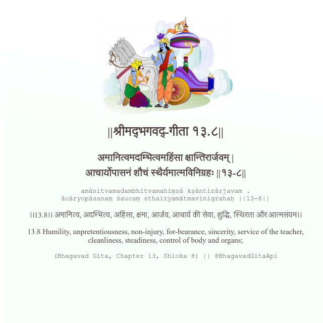

<h2>||श्रीमद्‍भगवद्‍-गीता १३.८||</h2>
<h3>अमानित्वमदम्भित्वमहिंसा क्षान्तिरार्जवम् | आचार्योपासनं शौचं स्थैर्यमात्मविनिग्रहः ||१३-८||</h3>
<pre>amānitvamadambhitvamahiṃsā kṣāntirārjavam . ācāryopāsanaṃ śaucaṃ sthairyamātmavinigrahaḥ ||13-8||</pre>

।।13.8।। अमानित्व, अदम्भित्व, अहिंसा, क्षमा, आर्जव, आचार्य की सेवा, शुद्धि, स्थिरता और आत्मसंयम।।

<pre>(Bhagavad Gita, Chapter 13, Shloka 8) || @BhagavadGitaApi</pre>
https://docs.bhagavadgitaapi.in/

#API #bhagavadgitaapi #slok #nodejs #js #api #gitaapi #krishna #hinduism #vedic #ISKCON #shreemadbhagavadgita #technology

