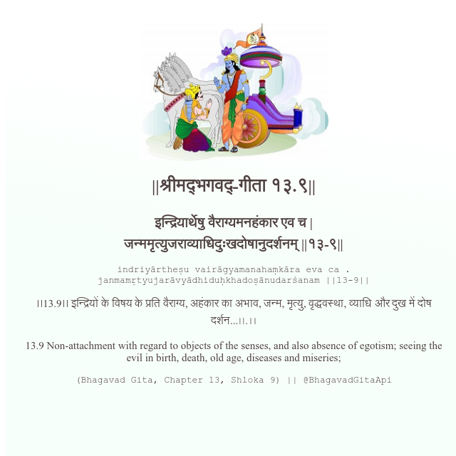

<h2>||श्रीमद्‍भगवद्‍-गीता १३.९||</h2>
<h3>इन्द्रियार्थेषु वैराग्यमनहंकार एव च | जन्ममृत्युजराव्याधिदुःखदोषानुदर्शनम् ||१३-९||</h3>
<pre>indriyārtheṣu vairāgyamanahaṃkāra eva ca . janmamṛtyujarāvyādhiduḥkhadoṣānudarśanam ||13-9||</pre>

।।13.9।। इन्द्रियों के विषय के प्रति वैराग्य, अहंकार का अभाव, जन्म, मृत्यु, वृद्धवस्था, व्याधि और दुख में दोष दर्शन...৷৷.।।

<pre>(Bhagavad Gita, Chapter 13, Shloka 9) || @BhagavadGitaApi</pre>
https://vedicscriptures.github.io/

#API #bhagavadgitaapi #slok #nodejs #js #api #gitaapi #krishna #hinduism #vedic #ISKCON #shreemadbhagavadgita #technology

