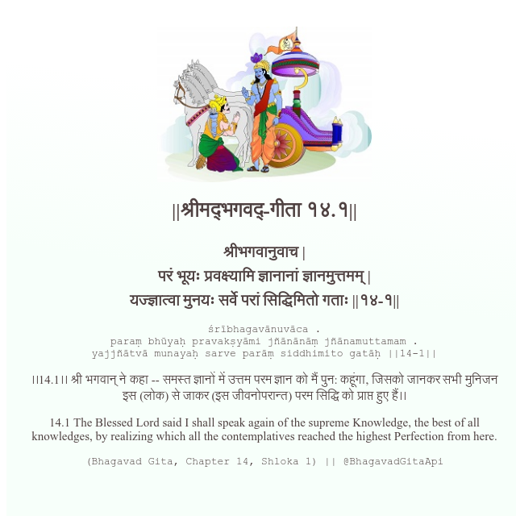

<h2>||श्रीमद्‍भगवद्‍-गीता १४.१||</h2>
<h3>श्रीभगवानुवाच | परं भूयः प्रवक्ष्यामि ज्ञानानां ज्ञानमुत्तमम् | यज्ज्ञात्वा मुनयः सर्वे परां सिद्धिमितो गताः ||१४-१||</h3>
<pre>śrībhagavānuvāca . paraṃ bhūyaḥ pravakṣyāmi jñānānāṃ jñānamuttamam . yajjñātvā munayaḥ sarve parāṃ siddhimito gatāḥ ||14-1||</pre>

।।14.1।। श्री भगवान् ने कहा -- समस्त ज्ञानों में उत्तम परम ज्ञान को मैं पुन: कहूंगा, जिसको जानकर सभी मुनिजन इस (लोक) से जाकर (इस जीवनोपरान्त) परम सिद्धि को प्राप्त हुए हैं।।

<pre>(Bhagavad Gita, Chapter 14, Shloka 1) || @BhagavadGitaApi</pre>
https://bhagavadgitaapi.in/

#API #bhagavadgitaapi #slok #nodejs #js #api #gitaapi #krishna #hinduism #vedic #ISKCON #shreemadbhagavadgita #technology

