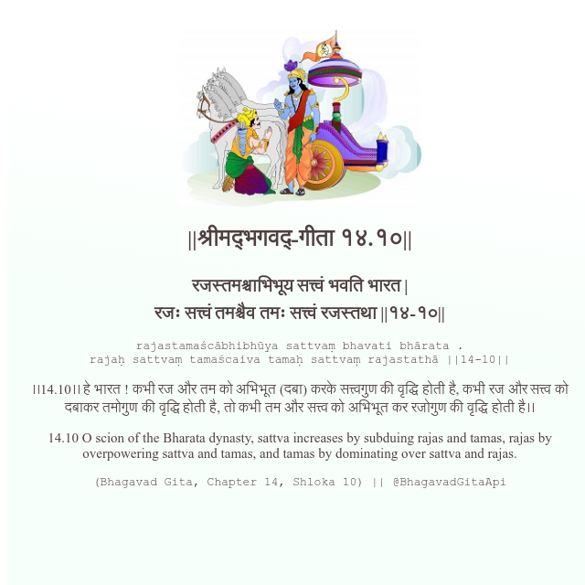

<h2>||श्रीमद्‍भगवद्‍-गीता १४.१०||</h2>
<h3>रजस्तमश्चाभिभूय सत्त्वं भवति भारत | रजः सत्त्वं तमश्चैव तमः सत्त्वं रजस्तथा ||१४-१०||</h3>
<pre>rajastamaścābhibhūya sattvaṃ bhavati bhārata . rajaḥ sattvaṃ tamaścaiva tamaḥ sattvaṃ rajastathā ||14-10||</pre>

।।14.10।। हे भारत ! कभी रज और तम को अभिभूत (दबा) करके सत्त्वगुण की वृद्धि होती है, कभी रज और सत्त्व को दबाकर तमोगुण की वृद्धि होती है, तो कभी तम और सत्त्व को अभिभूत कर रजोगुण की वृद्धि होती है।।

<pre>(Bhagavad Gita, Chapter 14, Shloka 10) || @BhagavadGitaApi</pre>
https://docs.bhagavadgitaapi.in/

#API #bhagavadgitaapi #slok #nodejs #js #api #gitaapi #krishna #hinduism #vedic #ISKCON #shreemadbhagavadgita #technology

