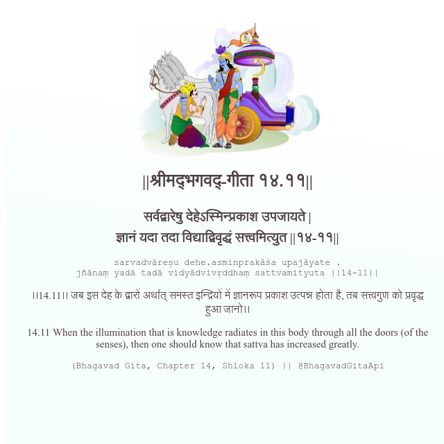

<h2>||श्रीमद्‍भगवद्‍-गीता १४.११||</h2>
<h3>सर्वद्वारेषु देहेऽस्मिन्प्रकाश उपजायते | ज्ञानं यदा तदा विद्याद्विवृद्धं सत्त्वमित्युत ||१४-११||</h3>
<pre>sarvadvāreṣu dehe.asminprakāśa upajāyate . jñānaṃ yadā tadā vidyādvivṛddhaṃ sattvamityuta ||14-11||</pre>

।।14.11।। जब इस देह के द्वारों अर्थात् समस्त इन्द्रियों में ज्ञानरूप प्रकाश उत्पन्न होता है, तब सत्त्वगुण को प्रवृद्ध हुआ जानो।।

<pre>(Bhagavad Gita, Chapter 14, Shloka 11) || @BhagavadGitaApi</pre>
https://bhagavadgitaapi.in/

#API #bhagavadgitaapi #slok #nodejs #js #api #gitaapi #krishna #hinduism #vedic #ISKCON #shreemadbhagavadgita #technology

