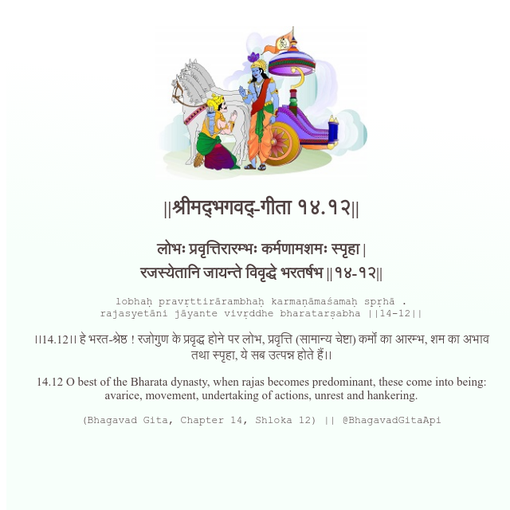

<h2>||श्रीमद्‍भगवद्‍-गीता १४.१२||</h2>
<h3>लोभः प्रवृत्तिरारम्भः कर्मणामशमः स्पृहा | रजस्येतानि जायन्ते विवृद्धे भरतर्षभ ||१४-१२||</h3>
<pre>lobhaḥ pravṛttirārambhaḥ karmaṇāmaśamaḥ spṛhā . rajasyetāni jāyante vivṛddhe bharatarṣabha ||14-12||</pre>

।।14.12।। हे भरत-श्रेष्ठ ! रजोगुण के प्रवृद्ध होने पर लोभ, प्रवृत्ति (सामान्य चेष्टा) कर्मों का आरम्भ, शम का अभाव तथा स्पृहा, ये सब उत्पन्न होते हैं।।

<pre>(Bhagavad Gita, Chapter 14, Shloka 12) || @BhagavadGitaApi</pre>
https://vedicscriptures.github.io/

#API #bhagavadgitaapi #slok #nodejs #js #api #gitaapi #krishna #hinduism #vedic #ISKCON #shreemadbhagavadgita #technology

