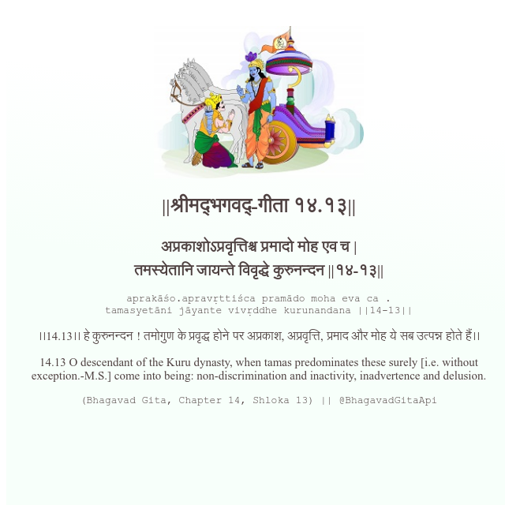

<h2>||श्रीमद्‍भगवद्‍-गीता १४.१३||</h2>
<h3>अप्रकाशोऽप्रवृत्तिश्च प्रमादो मोह एव च | तमस्येतानि जायन्ते विवृद्धे कुरुनन्दन ||१४-१३||</h3>
<pre>aprakāśo.apravṛttiśca pramādo moha eva ca . tamasyetāni jāyante vivṛddhe kurunandana ||14-13||</pre>

।।14.13।। हे कुरुनन्दन ! तमोगुण के प्रवृद्ध होने पर अप्रकाश, अप्रवृत्ति, प्रमाद और मोह ये सब उत्पन्न होते हैं।।

<pre>(Bhagavad Gita, Chapter 14, Shloka 13) || @BhagavadGitaApi</pre>
https://vedicscriptures.github.io/

#API #bhagavadgitaapi #slok #nodejs #js #api #gitaapi #krishna #hinduism #vedic #ISKCON #shreemadbhagavadgita #technology

