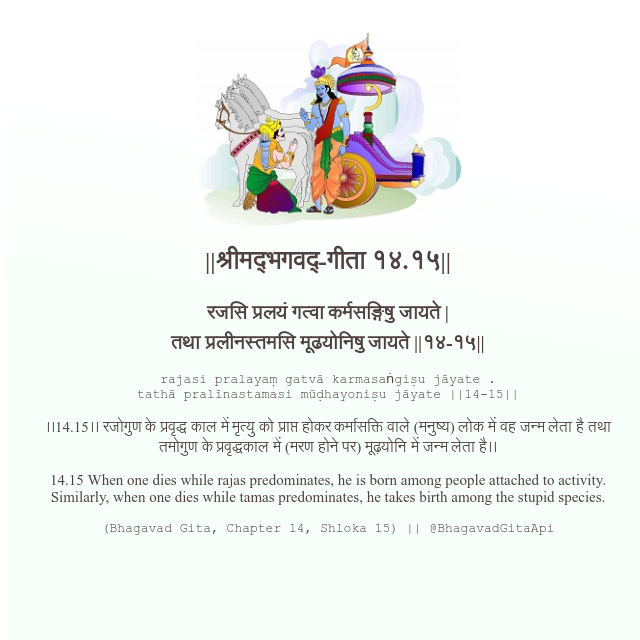

<h2>||श्रीमद्‍भगवद्‍-गीता १४.१५||</h2>
<h3>रजसि प्रलयं गत्वा कर्मसङ्गिषु जायते | तथा प्रलीनस्तमसि मूढयोनिषु जायते ||१४-१५||</h3>
<pre>rajasi pralayaṃ gatvā karmasaṅgiṣu jāyate . tathā pralīnastamasi mūḍhayoniṣu jāyate ||14-15||</pre>

।।14.15।। रजोगुण के प्रवृद्ध काल में मृत्यु को प्राप्त होकर कर्मासक्ति वाले (मनुष्य) लोक में वह जन्म लेता है तथा तमोगुण के प्रवृद्धकाल में (मरण होने पर) मूढ़योनि में जन्म लेता है।।

<pre>(Bhagavad Gita, Chapter 14, Shloka 15) || @BhagavadGitaApi</pre>
https://docs.bhagavadgitaapi.in/

#API #bhagavadgitaapi #slok #nodejs #js #api #gitaapi #krishna #hinduism #vedic #ISKCON #shreemadbhagavadgita #technology

