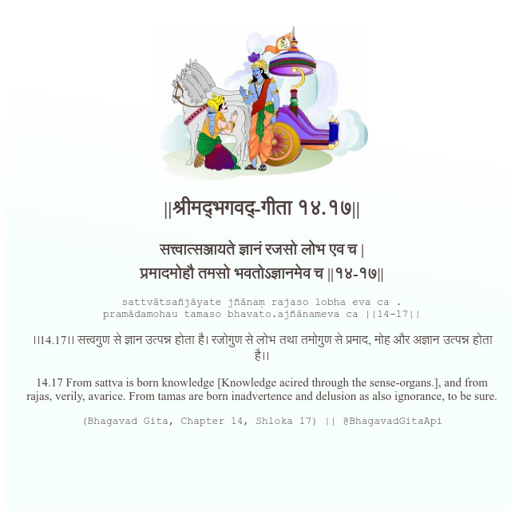

<h2>||श्रीमद्‍भगवद्‍-गीता १४.१७||</h2>
<h3>सत्त्वात्सञ्जायते ज्ञानं रजसो लोभ एव च | प्रमादमोहौ तमसो भवतोऽज्ञानमेव च ||१४-१७||</h3>
<pre>sattvātsañjāyate jñānaṃ rajaso lobha eva ca . pramādamohau tamaso bhavato.ajñānameva ca ||14-17||</pre>

।।14.17।। सत्त्वगुण से ज्ञान उत्पन्न होता है। रजोगुण से लोभ तथा तमोगुण से प्रमाद, मोह और अज्ञान उत्पन्न होता है।।

<pre>(Bhagavad Gita, Chapter 14, Shloka 17) || @BhagavadGitaApi</pre>
https://vedicscriptures.github.io/

#API #bhagavadgitaapi #slok #nodejs #js #api #gitaapi #krishna #hinduism #vedic #ISKCON #shreemadbhagavadgita #technology

