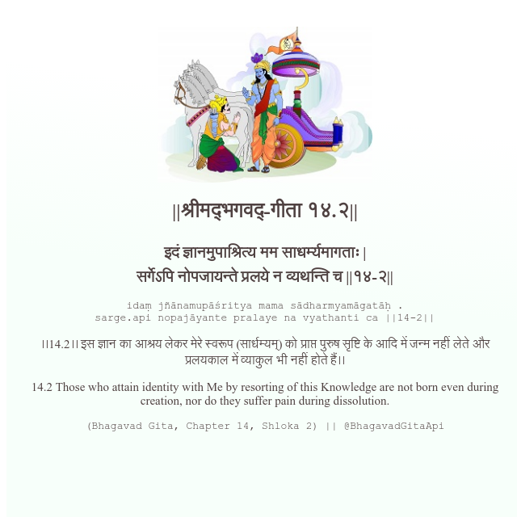

<h2>||श्रीमद्‍भगवद्‍-गीता १४.२||</h2>
<h3>इदं ज्ञानमुपाश्रित्य मम साधर्म्यमागताः | सर्गेऽपि नोपजायन्ते प्रलये न व्यथन्ति च ||१४-२||</h3>
<pre>idaṃ jñānamupāśritya mama sādharmyamāgatāḥ . sarge.api nopajāyante pralaye na vyathanti ca ||14-2||</pre>

।।14.2।। इस ज्ञान का आश्रय लेकर मेरे स्वरूप (सार्धम्यम्) को प्राप्त पुरुष सृष्टि के आदि में जन्म नहीं लेते और प्रलयकाल में व्याकुल भी नहीं होते हैं।।

<pre>(Bhagavad Gita, Chapter 14, Shloka 2) || @BhagavadGitaApi</pre>
https://bhagavadgitaapi.in/

#API #bhagavadgitaapi #slok #nodejs #js #api #gitaapi #krishna #hinduism #vedic #ISKCON #shreemadbhagavadgita #technology

