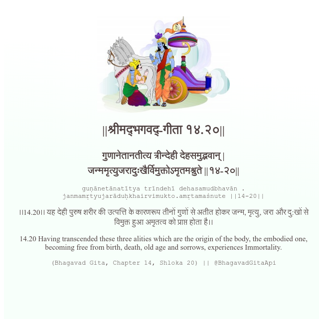

<h2>||श्रीमद्‍भगवद्‍-गीता १४.२०||</h2>
<h3>गुणानेतानतीत्य त्रीन्देही देहसमुद्भवान् | जन्ममृत्युजरादुःखैर्विमुक्तोऽमृतमश्नुते ||१४-२०||</h3>
<pre>guṇānetānatītya trīndehī dehasamudbhavān . janmamṛtyujarāduḥkhairvimukto.amṛtamaśnute ||14-20||</pre>

।।14.20।। यह देही पुरुष शरीर की उत्पत्ति के कारणरूप तीनों गुणों से अतीत होकर जन्म, मृत्यु, जरा और दु:खों से विमुक्त हुआ अमृतत्व को प्राप्त होता है।।

<pre>(Bhagavad Gita, Chapter 14, Shloka 20) || @BhagavadGitaApi</pre>
https://vedicscriptures.github.io/

#API #bhagavadgitaapi #slok #nodejs #js #api #gitaapi #krishna #hinduism #vedic #ISKCON #shreemadbhagavadgita #technology

