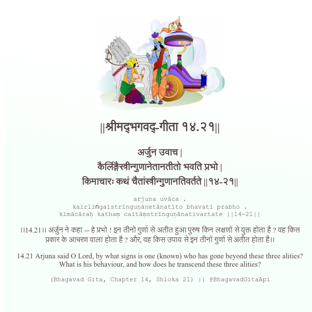

<h2>||श्रीमद्‍भगवद्‍-गीता १४.२१||</h2>
<h3>अर्जुन उवाच | कैर्लिङ्गैस्त्रीन्गुणानेतानतीतो भवति प्रभो | किमाचारः कथं चैतांस्त्रीन्गुणानतिवर्तते ||१४-२१||</h3>
<pre>arjuna uvāca . kairliṅgaistrīnguṇānetānatīto bhavati prabho . kimācāraḥ kathaṃ caitāṃstrīnguṇānativartate ||14-21||</pre>

।।14.21।। अर्जुन ने कहा -- हे प्रभो ! इन तीनो गुणों से अतीत हुआ पुरुष किन लक्षणों से युक्त होता है ? वह किस प्रकार के आचरण वाला होता है ? और, वह किस उपाय से इन तीनों गुणों से अतीत होता है।।

<pre>(Bhagavad Gita, Chapter 14, Shloka 21) || @BhagavadGitaApi</pre>
https://docs.bhagavadgitaapi.in/

#API #bhagavadgitaapi #slok #nodejs #js #api #gitaapi #krishna #hinduism #vedic #ISKCON #shreemadbhagavadgita #technology

