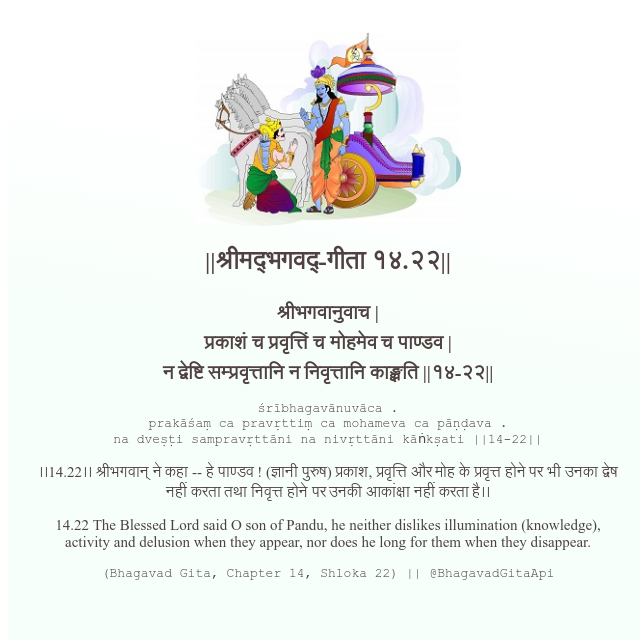

<h2>||श्रीमद्‍भगवद्‍-गीता १४.२२||</h2>
<h3>श्रीभगवानुवाच | प्रकाशं च प्रवृत्तिं च मोहमेव च पाण्डव | न द्वेष्टि सम्प्रवृत्तानि न निवृत्तानि काङ्क्षति ||१४-२२||</h3>
<pre>śrībhagavānuvāca . prakāśaṃ ca pravṛttiṃ ca mohameva ca pāṇḍava . na dveṣṭi sampravṛttāni na nivṛttāni kāṅkṣati ||14-22||</pre>

।।14.22।। श्रीभगवान् ने कहा -- हे पाण्डव ! (ज्ञानी पुरुष) प्रकाश, प्रवृत्ति और मोह के प्रवृत्त होने पर भी उनका द्वेष नहीं करता तथा निवृत्त होने पर उनकी आकांक्षा नहीं करता है।।

<pre>(Bhagavad Gita, Chapter 14, Shloka 22) || @BhagavadGitaApi</pre>
https://bhagavadgitaapi.in/

#API #bhagavadgitaapi #slok #nodejs #js #api #gitaapi #krishna #hinduism #vedic #ISKCON #shreemadbhagavadgita #technology

