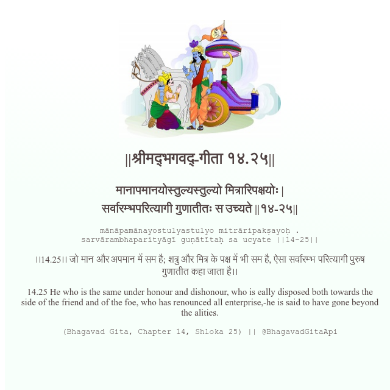

<h2>||श्रीमद्‍भगवद्‍-गीता १४.२५||</h2>
<h3>मानापमानयोस्तुल्यस्तुल्यो मित्रारिपक्षयोः | सर्वारम्भपरित्यागी गुणातीतः स उच्यते ||१४-२५||</h3>
<pre>mānāpamānayostulyastulyo mitrāripakṣayoḥ . sarvārambhaparityāgī guṇātītaḥ sa ucyate ||14-25||</pre>

।।14.25।। जो मान और अपमान में सम है; शत्रु और मित्र के पक्ष में भी सम है, ऐसा सर्वारम्भ परित्यागी पुरुष गुणातीत कहा जाता है।।

<pre>(Bhagavad Gita, Chapter 14, Shloka 25) || @BhagavadGitaApi</pre>
https://docs.bhagavadgitaapi.in/

#API #bhagavadgitaapi #slok #nodejs #js #api #gitaapi #krishna #hinduism #vedic #ISKCON #shreemadbhagavadgita #technology

