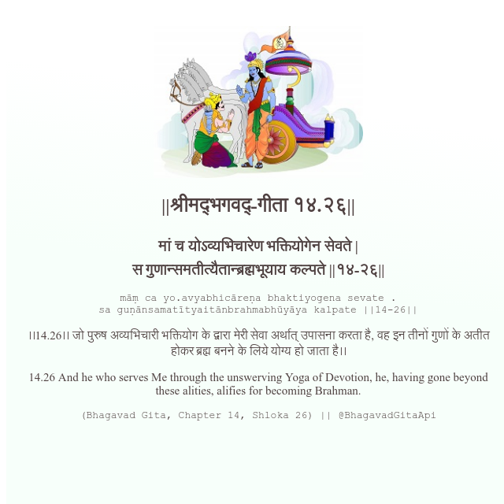

<h2>||श्रीमद्‍भगवद्‍-गीता १४.२६||</h2>
<h3>मां च योऽव्यभिचारेण भक्तियोगेन सेवते | स गुणान्समतीत्यैतान्ब्रह्मभूयाय कल्पते ||१४-२६||</h3>
<pre>māṃ ca yo.avyabhicāreṇa bhaktiyogena sevate . sa guṇānsamatītyaitānbrahmabhūyāya kalpate ||14-26||</pre>

।।14.26।। जो पुरुष अव्यभिचारी भक्तियोग के द्वारा मेरी सेवा अर्थात् उपासना करता है, वह इन तीनों गुणों के अतीत होकर ब्रह्म बनने के लिये योग्य हो जाता है।।

<pre>(Bhagavad Gita, Chapter 14, Shloka 26) || @BhagavadGitaApi</pre>
https://bhagavadgitaapi.in/

#API #bhagavadgitaapi #slok #nodejs #js #api #gitaapi #krishna #hinduism #vedic #ISKCON #shreemadbhagavadgita #technology

