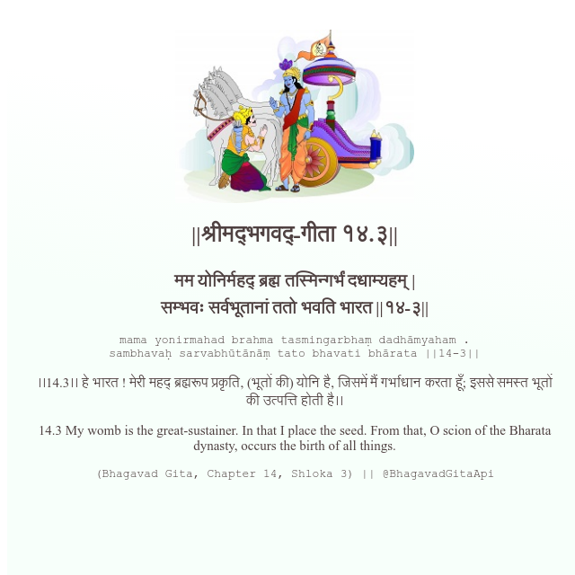

<h2>||श्रीमद्‍भगवद्‍-गीता १४.३||</h2>
<h3>मम योनिर्महद् ब्रह्म तस्मिन्गर्भं दधाम्यहम् | सम्भवः सर्वभूतानां ततो भवति भारत ||१४-३||</h3>
<pre>mama yonirmahad brahma tasmingarbhaṃ dadhāmyaham . sambhavaḥ sarvabhūtānāṃ tato bhavati bhārata ||14-3||</pre>

।।14.3।। हे भारत ! मेरी महद् ब्रह्मरूप प्रकृति, (भूतों की) योनि है, जिसमें मैं गर्भाधान करता हूँ; इससे समस्त भूतों की उत्पत्ति होती है।।

<pre>(Bhagavad Gita, Chapter 14, Shloka 3) || @BhagavadGitaApi</pre>
https://vedicscriptures.github.io/

#API #bhagavadgitaapi #slok #nodejs #js #api #gitaapi #krishna #hinduism #vedic #ISKCON #shreemadbhagavadgita #technology

