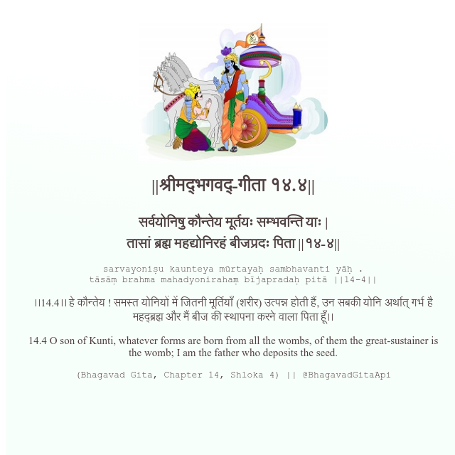

<h2>||श्रीमद्‍भगवद्‍-गीता १४.४||</h2>
<h3>सर्वयोनिषु कौन्तेय मूर्तयः सम्भवन्ति याः | तासां ब्रह्म महद्योनिरहं बीजप्रदः पिता ||१४-४||</h3>
<pre>sarvayoniṣu kaunteya mūrtayaḥ sambhavanti yāḥ . tāsāṃ brahma mahadyonirahaṃ bījapradaḥ pitā ||14-4||</pre>

।।14.4।। हे कौन्तेय ! समस्त योनियों में जितनी मूर्तियाँ (शरीर) उत्पन्न होती हैं, उन सबकी योनि अर्थात् गर्भ है महद्ब्रह्म और मैं बीज की स्थापना करने वाला पिता हूँ।।

<pre>(Bhagavad Gita, Chapter 14, Shloka 4) || @BhagavadGitaApi</pre>
https://bhagavadgitaapi.in/

#API #bhagavadgitaapi #slok #nodejs #js #api #gitaapi #krishna #hinduism #vedic #ISKCON #shreemadbhagavadgita #technology

