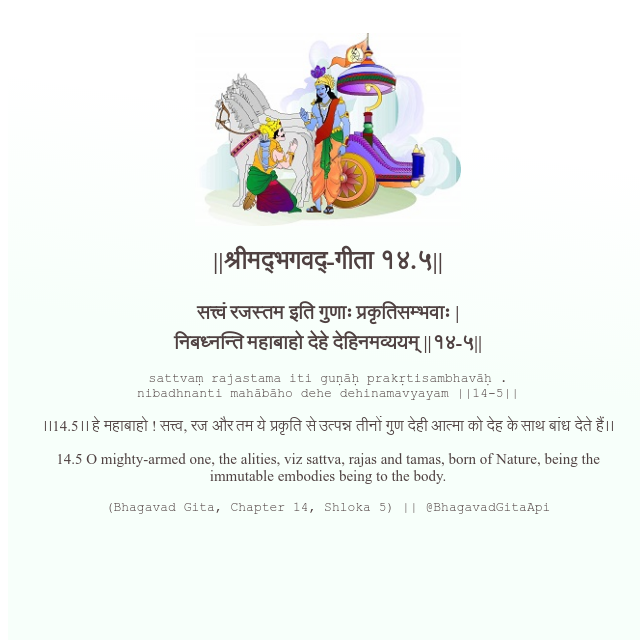

<h2>||श्रीमद्‍भगवद्‍-गीता १४.५||</h2>
<h3>सत्त्वं रजस्तम इति गुणाः प्रकृतिसम्भवाः | निबध्नन्ति महाबाहो देहे देहिनमव्ययम् ||१४-५||</h3>
<pre>sattvaṃ rajastama iti guṇāḥ prakṛtisambhavāḥ . nibadhnanti mahābāho dehe dehinamavyayam ||14-5||</pre>

।।14.5।। हे महाबाहो ! सत्त्व, रज और तम ये प्रकृति से उत्पन्न तीनों गुण देही आत्मा को देह के साथ बांध देते हैं।।

<pre>(Bhagavad Gita, Chapter 14, Shloka 5) || @BhagavadGitaApi</pre>
https://bhagavadgitaapi.in/

#API #bhagavadgitaapi #slok #nodejs #js #api #gitaapi #krishna #hinduism #vedic #ISKCON #shreemadbhagavadgita #technology

