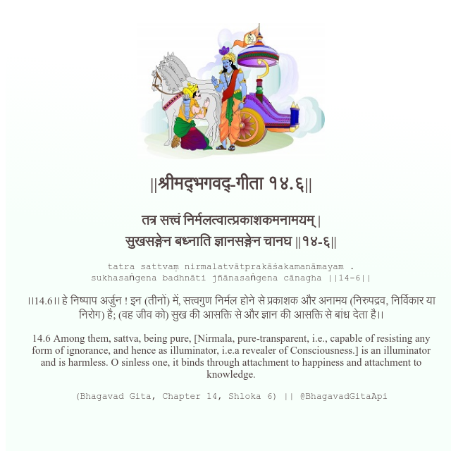

<h2>||श्रीमद्‍भगवद्‍-गीता १४.६||</h2>
<h3>तत्र सत्त्वं निर्मलत्वात्प्रकाशकमनामयम् | सुखसङ्गेन बध्नाति ज्ञानसङ्गेन चानघ ||१४-६||</h3>
<pre>tatra sattvaṃ nirmalatvātprakāśakamanāmayam . sukhasaṅgena badhnāti jñānasaṅgena cānagha ||14-6||</pre>

।।14.6।। हे निष्पाप अर्जुन ! इन (तीनों) में, सत्त्वगुण निर्मल होने से प्रकाशक और अनामय (निरुपद्रव, निर्विकार या निरोग) है; (वह जीव को) सुख की आसक्ति से और ज्ञान की आसक्ति से बांध देता है।।

<pre>(Bhagavad Gita, Chapter 14, Shloka 6) || @BhagavadGitaApi</pre>
https://bhagavadgitaapi.in/

#API #bhagavadgitaapi #slok #nodejs #js #api #gitaapi #krishna #hinduism #vedic #ISKCON #shreemadbhagavadgita #technology

