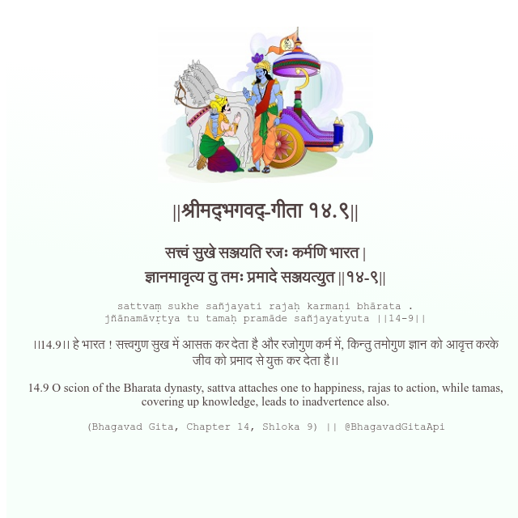

<h2>||श्रीमद्‍भगवद्‍-गीता १४.९||</h2>
<h3>सत्त्वं सुखे सञ्जयति रजः कर्मणि भारत | ज्ञानमावृत्य तु तमः प्रमादे सञ्जयत्युत ||१४-९||</h3>
<pre>sattvaṃ sukhe sañjayati rajaḥ karmaṇi bhārata . jñānamāvṛtya tu tamaḥ pramāde sañjayatyuta ||14-9||</pre>

।।14.9।। हे भारत ! सत्त्वगुण सुख में आसक्त कर देता है और रजोगुण कर्म में, किन्तु तमोगुण ज्ञान को आवृत्त करके जीव को प्रमाद से युक्त कर देता है।।

<pre>(Bhagavad Gita, Chapter 14, Shloka 9) || @BhagavadGitaApi</pre>
https://bhagavadgitaapi.in/

#API #bhagavadgitaapi #slok #nodejs #js #api #gitaapi #krishna #hinduism #vedic #ISKCON #shreemadbhagavadgita #technology

