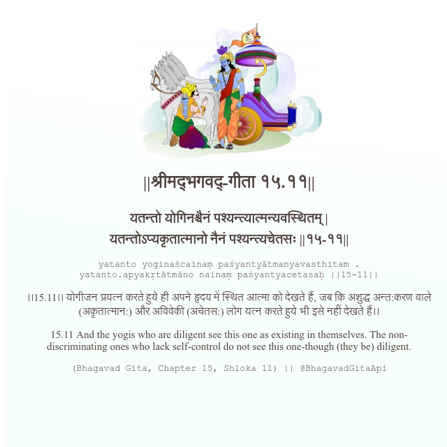

<h2>||श्रीमद्‍भगवद्‍-गीता १५.११||</h2>
<h3>यतन्तो योगिनश्चैनं पश्यन्त्यात्मन्यवस्थितम् | यतन्तोऽप्यकृतात्मानो नैनं पश्यन्त्यचेतसः ||१५-११||</h3>
<pre>yatanto yoginaścainaṃ paśyantyātmanyavasthitam . yatanto.apyakṛtātmāno nainaṃ paśyantyacetasaḥ ||15-11||</pre>

।।15.11।। योगीजन प्रयत्न करते हुये ही अपने हृदय में स्थित आत्मा को देखते हैं, जब कि अशुद्ध अन्त:करण वाले (अकृतात्मान:) और अविवेकी (अचेतस:) लोग यत्न करते हुये भी इसे नहीं देखते हैं।।

<pre>(Bhagavad Gita, Chapter 15, Shloka 11) || @BhagavadGitaApi</pre>
https://docs.bhagavadgitaapi.in/

#API #bhagavadgitaapi #slok #nodejs #js #api #gitaapi #krishna #hinduism #vedic #ISKCON #shreemadbhagavadgita #technology

