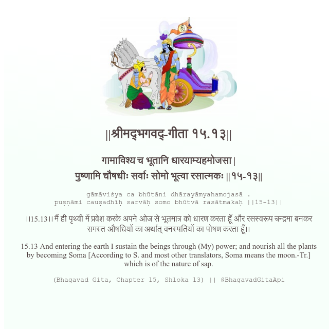

<h2>||श्रीमद्‍भगवद्‍-गीता १५.१३||</h2>
<h3>गामाविश्य च भूतानि धारयाम्यहमोजसा | पुष्णामि चौषधीः सर्वाः सोमो भूत्वा रसात्मकः ||१५-१३||</h3>
<pre>gāmāviśya ca bhūtāni dhārayāmyahamojasā . puṣṇāmi cauṣadhīḥ sarvāḥ somo bhūtvā rasātmakaḥ ||15-13||</pre>

।।15.13।। मैं ही पृथ्वी में प्रवेश करके अपने ओज से भूतमात्र को धारण करता हूँ और रसस्वरूप चन्द्रमा बनकर समस्त औषधियों का अर्थात् वनस्पतियों का पोषण करता हूँ।।

<pre>(Bhagavad Gita, Chapter 15, Shloka 13) || @BhagavadGitaApi</pre>
https://docs.bhagavadgitaapi.in/

#API #bhagavadgitaapi #slok #nodejs #js #api #gitaapi #krishna #hinduism #vedic #ISKCON #shreemadbhagavadgita #technology

