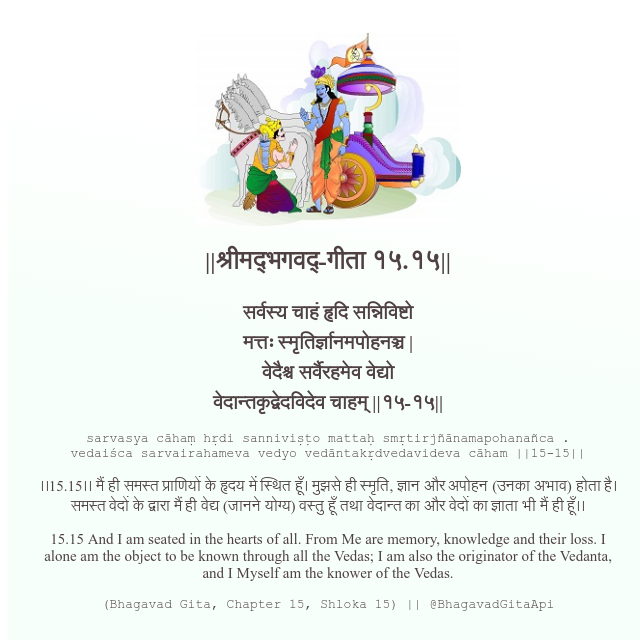

<h2>||श्रीमद्‍भगवद्‍-गीता १५.१५||</h2>
<h3>सर्वस्य चाहं हृदि सन्निविष्टो मत्तः स्मृतिर्ज्ञानमपोहनञ्च | वेदैश्च सर्वैरहमेव वेद्यो वेदान्तकृद्वेदविदेव चाहम् ||१५-१५||</h3>
<pre>sarvasya cāhaṃ hṛdi sanniviṣṭo mattaḥ smṛtirjñānamapohanañca . vedaiśca sarvairahameva vedyo vedāntakṛdvedavideva cāham ||15-15||</pre>

।।15.15।। मैं ही समस्त प्राणियों के हृदय में स्थित हूँ। मुझसे ही स्मृति, ज्ञान और अपोहन (उनका अभाव) होता है। समस्त वेदों के द्वारा मैं ही वेद्य (जानने योग्य) वस्तु हूँ तथा वेदान्त का और वेदों का ज्ञाता भी मैं ही हूँ।।

<pre>(Bhagavad Gita, Chapter 15, Shloka 15) || @BhagavadGitaApi</pre>
https://docs.bhagavadgitaapi.in/

#API #bhagavadgitaapi #slok #nodejs #js #api #gitaapi #krishna #hinduism #vedic #ISKCON #shreemadbhagavadgita #technology

