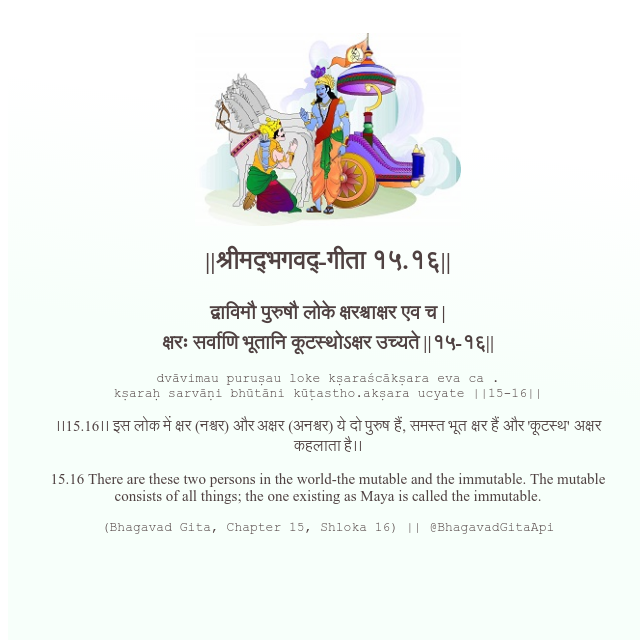

<h2>||श्रीमद्‍भगवद्‍-गीता १५.१६||</h2>
<h3>द्वाविमौ पुरुषौ लोके क्षरश्चाक्षर एव च | क्षरः सर्वाणि भूतानि कूटस्थोऽक्षर उच्यते ||१५-१६||</h3>
<pre>dvāvimau puruṣau loke kṣaraścākṣara eva ca . kṣaraḥ sarvāṇi bhūtāni kūṭastho.akṣara ucyate ||15-16||</pre>

।।15.16।। इस लोक में क्षर (नश्वर) और अक्षर (अनश्वर) ये दो पुरुष हैं, समस्त भूत क्षर हैं और 'कूटस्थ' अक्षर कहलाता है।।

<pre>(Bhagavad Gita, Chapter 15, Shloka 16) || @BhagavadGitaApi</pre>
https://bhagavadgitaapi.in/

#API #bhagavadgitaapi #slok #nodejs #js #api #gitaapi #krishna #hinduism #vedic #ISKCON #shreemadbhagavadgita #technology

