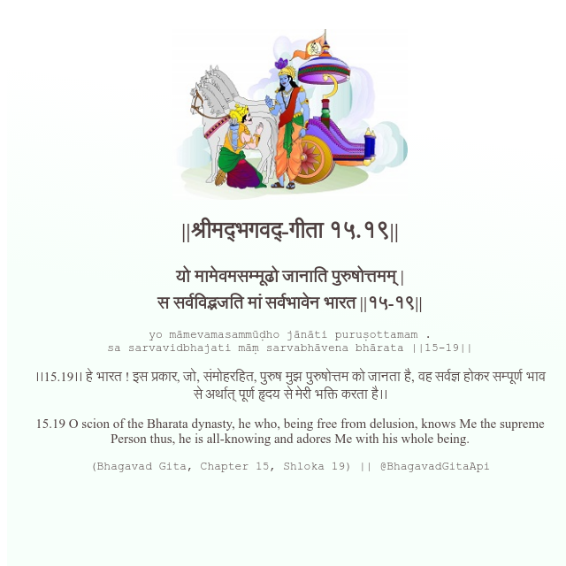

<h2>||श्रीमद्‍भगवद्‍-गीता १५.१९||</h2>
<h3>यो मामेवमसम्मूढो जानाति पुरुषोत्तमम् | स सर्वविद्भजति मां सर्वभावेन भारत ||१५-१९||</h3>
<pre>yo māmevamasammūḍho jānāti puruṣottamam . sa sarvavidbhajati māṃ sarvabhāvena bhārata ||15-19||</pre>

।।15.19।। हे भारत ! इस प्रकार, जो, संमोहरहित, पुरुष मुझ पुरुषोत्तम को जानता है, वह सर्वज्ञ होकर सम्पूर्ण भाव से अर्थात् पूर्ण हृदय से मेरी भक्ति करता है।।

<pre>(Bhagavad Gita, Chapter 15, Shloka 19) || @BhagavadGitaApi</pre>
https://bhagavadgitaapi.in/

#API #bhagavadgitaapi #slok #nodejs #js #api #gitaapi #krishna #hinduism #vedic #ISKCON #shreemadbhagavadgita #technology

