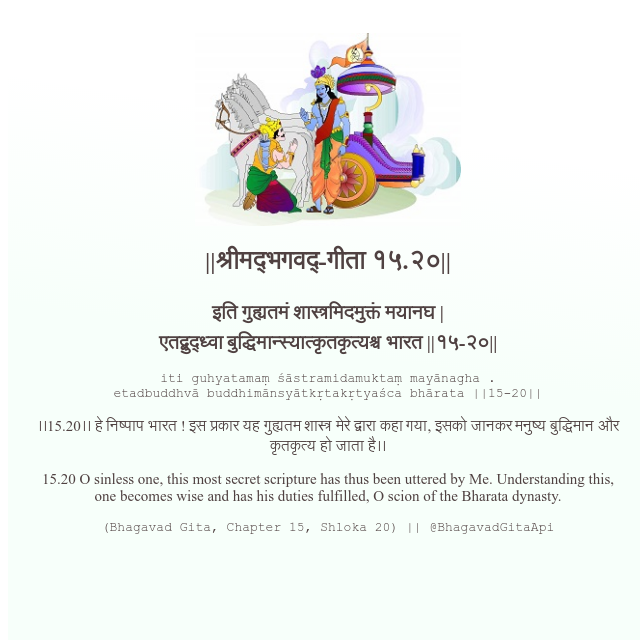

<h2>||श्रीमद्‍भगवद्‍-गीता १५.२०||</h2>
<h3>इति गुह्यतमं शास्त्रमिदमुक्तं मयानघ | एतद्बुद्ध्वा बुद्धिमान्स्यात्कृतकृत्यश्च भारत ||१५-२०||</h3>
<pre>iti guhyatamaṃ śāstramidamuktaṃ mayānagha . etadbuddhvā buddhimānsyātkṛtakṛtyaśca bhārata ||15-20||</pre>

।।15.20।। हे निष्पाप भारत ! इस प्रकार यह गुह्यतम शास्त्र मेरे द्वारा कहा गया, इसको जानकर मनुष्य बुद्धिमान और कृतकृत्य हो जाता है।।

<pre>(Bhagavad Gita, Chapter 15, Shloka 20) || @BhagavadGitaApi</pre>
https://bhagavadgitaapi.in/

#API #bhagavadgitaapi #slok #nodejs #js #api #gitaapi #krishna #hinduism #vedic #ISKCON #shreemadbhagavadgita #technology

