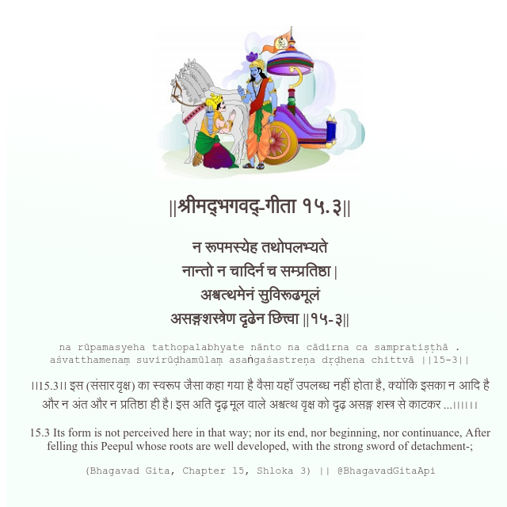

<h2>||श्रीमद्‍भगवद्‍-गीता १५.३||</h2>
<h3>न रूपमस्येह तथोपलभ्यते नान्तो न चादिर्न च सम्प्रतिष्ठा | अश्वत्थमेनं सुविरूढमूलं असङ्गशस्त्रेण दृढेन छित्त्वा ||१५-३||</h3>
<pre>na rūpamasyeha tathopalabhyate nānto na cādirna ca sampratiṣṭhā . aśvatthamenaṃ suvirūḍhamūlaṃ asaṅgaśastreṇa dṛḍhena chittvā ||15-3||</pre>

।।15.3।। इस (संसार वृक्ष) का स्वरूप जैसा कहा गया है वैसा यहाँ उपलब्ध नहीं होता है, क्योंकि इसका न आदि है और न अंत और न प्रतिष्ठा ही है। इस अति दृढ़ मूल वाले अश्वत्थ वृक्ष को दृढ़ असङ्ग शस्त्र से काटकर ...৷৷৷৷।।

<pre>(Bhagavad Gita, Chapter 15, Shloka 3) || @BhagavadGitaApi</pre>
https://bhagavadgitaapi.in/

#API #bhagavadgitaapi #slok #nodejs #js #api #gitaapi #krishna #hinduism #vedic #ISKCON #shreemadbhagavadgita #technology

