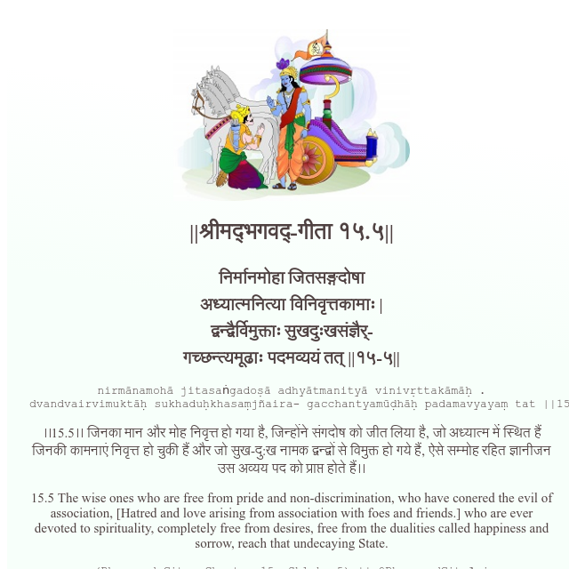

<h2>||श्रीमद्‍भगवद्‍-गीता १५.५||</h2>
<h3>निर्मानमोहा जितसङ्गदोषा अध्यात्मनित्या विनिवृत्तकामाः | द्वन्द्वैर्विमुक्ताः सुखदुःखसंज्ञैर्- गच्छन्त्यमूढाः पदमव्ययं तत् ||१५-५||</h3>
<pre>nirmānamohā jitasaṅgadoṣā adhyātmanityā vinivṛttakāmāḥ . dvandvairvimuktāḥ sukhaduḥkhasaṃjñaira- gacchantyamūḍhāḥ padamavyayaṃ tat ||15-5||</pre>

।।15.5।। जिनका मान और मोह निवृत्त हो गया है, जिन्होंने संगदोष को जीत लिया है, जो अध्यात्म में स्थित हैं जिनकी कामनाएं निवृत्त हो चुकी हैं और जो सुख-दु:ख नामक द्वन्द्वों से विमुक्त हो गये हैं, ऐसे सम्मोह रहित ज्ञानीजन उस अव्यय पद को प्राप्त होते हैं।।

<pre>(Bhagavad Gita, Chapter 15, Shloka 5) || @BhagavadGitaApi</pre>
https://bhagavadgitaapi.in/

#API #bhagavadgitaapi #slok #nodejs #js #api #gitaapi #krishna #hinduism #vedic #ISKCON #shreemadbhagavadgita #technology

