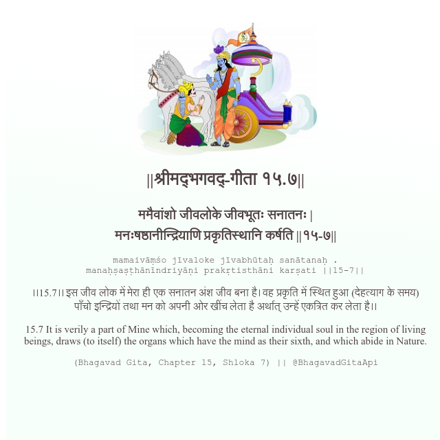

<h2>||श्रीमद्‍भगवद्‍-गीता १५.७||</h2>
<h3>ममैवांशो जीवलोके जीवभूतः सनातनः | मनःषष्ठानीन्द्रियाणि प्रकृतिस्थानि कर्षति ||१५-७||</h3>
<pre>mamaivāṃśo jīvaloke jīvabhūtaḥ sanātanaḥ . manaḥṣaṣṭhānīndriyāṇi prakṛtisthāni karṣati ||15-7||</pre>

।।15.7।। इस जीव लोक में मेरा ही एक सनातन अंश जीव बना है। वह प्रकृति में स्थित हुआ (देहत्याग के समय) पाँचो इन्द्रियों तथा मन को अपनी ओर खींच लेता है अर्थात् उन्हें एकत्रित कर लेता है।।

<pre>(Bhagavad Gita, Chapter 15, Shloka 7) || @BhagavadGitaApi</pre>
https://bhagavadgitaapi.in/

#API #bhagavadgitaapi #slok #nodejs #js #api #gitaapi #krishna #hinduism #vedic #ISKCON #shreemadbhagavadgita #technology

