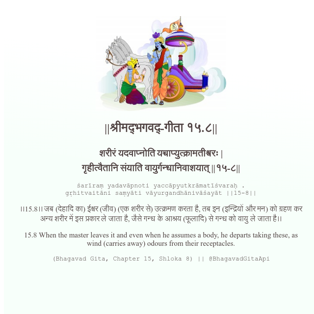

<h2>||श्रीमद्‍भगवद्‍-गीता १५.८||</h2>
<h3>शरीरं यदवाप्नोति यच्चाप्युत्क्रामतीश्वरः | गृहीत्वैतानि संयाति वायुर्गन्धानिवाशयात् ||१५-८||</h3>
<pre>śarīraṃ yadavāpnoti yaccāpyutkrāmatīśvaraḥ . gṛhitvaitāni saṃyāti vāyurgandhānivāśayāt ||15-8||</pre>

।।15.8।। जब (देहादि का) ईश्वर (जीव) (एक शरीर से) उत्क्रमण करता है, तब इन (इन्द्रियों और मन) को ग्रहण कर अन्य शरीर में इस प्रकार ले जाता है, जैसे गन्ध के आश्रय (फूलादि) से गन्ध को वायु ले जाता है।।

<pre>(Bhagavad Gita, Chapter 15, Shloka 8) || @BhagavadGitaApi</pre>
https://bhagavadgitaapi.in/

#API #bhagavadgitaapi #slok #nodejs #js #api #gitaapi #krishna #hinduism #vedic #ISKCON #shreemadbhagavadgita #technology

