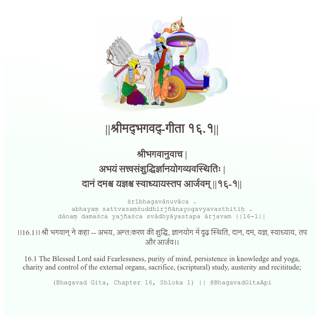

<h2>||श्रीमद्‍भगवद्‍-गीता १६.१||</h2>
<h3>श्रीभगवानुवाच | अभयं सत्त्वसंशुद्धिर्ज्ञानयोगव्यवस्थितिः | दानं दमश्च यज्ञश्च स्वाध्यायस्तप आर्जवम् ||१६-१||</h3>
<pre>śrībhagavānuvāca . abhayaṃ sattvasaṃśuddhirjñānayogavyavasthitiḥ . dānaṃ damaśca yajñaśca svādhyāyastapa ārjavam ||16-1||</pre>

।।16.1।। श्री भगवान् ने कहा -- अभय, अन्त:करण की शुद्धि, ज्ञानयोग में दृढ़ स्थिति, दान, दम, यज्ञ, स्वाध्याय, तप और आर्जव।।

<pre>(Bhagavad Gita, Chapter 16, Shloka 1) || @BhagavadGitaApi</pre>
https://bhagavadgitaapi.in/

#API #bhagavadgitaapi #slok #nodejs #js #api #gitaapi #krishna #hinduism #vedic #ISKCON #shreemadbhagavadgita #technology

