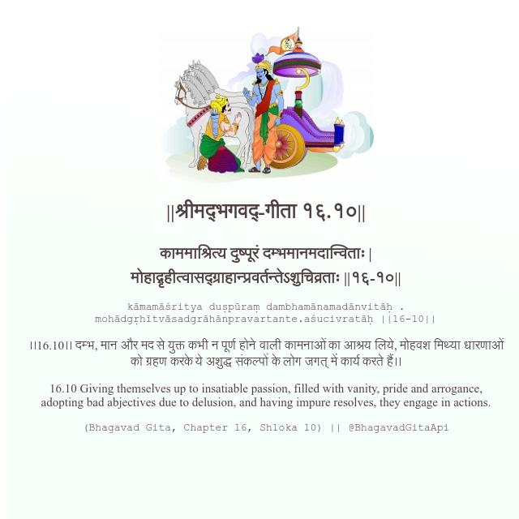

<h2>||श्रीमद्‍भगवद्‍-गीता १६.१०||</h2>
<h3>काममाश्रित्य दुष्पूरं दम्भमानमदान्विताः | मोहाद्गृहीत्वासद्ग्राहान्प्रवर्तन्तेऽशुचिव्रताः ||१६-१०||</h3>
<pre>kāmamāśritya duṣpūraṃ dambhamānamadānvitāḥ . mohādgṛhītvāsadgrāhānpravartante.aśucivratāḥ ||16-10||</pre>

।।16.10।। दम्भ, मान और मद से युक्त कभी न पूर्ण होने वाली कामनाओं का आश्रय लिये, मोहवश मिथ्या धारणाओं को ग्रहण करके ये अशुद्ध संकल्पों के लोग जगत् में कार्य करते हैं।।

<pre>(Bhagavad Gita, Chapter 16, Shloka 10) || @BhagavadGitaApi</pre>
https://docs.bhagavadgitaapi.in/

#API #bhagavadgitaapi #slok #nodejs #js #api #gitaapi #krishna #hinduism #vedic #ISKCON #shreemadbhagavadgita #technology

