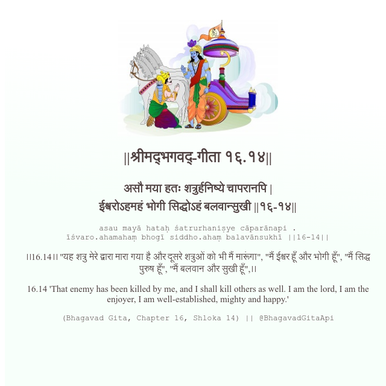

<h2>||श्रीमद्‍भगवद्‍-गीता १६.१४||</h2>
<h3>असौ मया हतः शत्रुर्हनिष्ये चापरानपि | ईश्वरोऽहमहं भोगी सिद्धोऽहं बलवान्सुखी ||१६-१४||</h3>
<pre>asau mayā hataḥ śatrurhaniṣye cāparānapi . īśvaro.ahamahaṃ bhogī siddho.ahaṃ balavānsukhī ||16-14||</pre>

।।16.14।। "यह शत्रु मेरे द्वारा मारा गया है और दूसरे शत्रुओं को भी मैं मारूंगा", "मैं ईश्वर हूँ और भोगी हूँ", "मैं सिद्ध पुरुष हूँ", "मैं बलवान और सुखी हूँ",।।

<pre>(Bhagavad Gita, Chapter 16, Shloka 14) || @BhagavadGitaApi</pre>
https://vedicscriptures.github.io/

#API #bhagavadgitaapi #slok #nodejs #js #api #gitaapi #krishna #hinduism #vedic #ISKCON #shreemadbhagavadgita #technology

