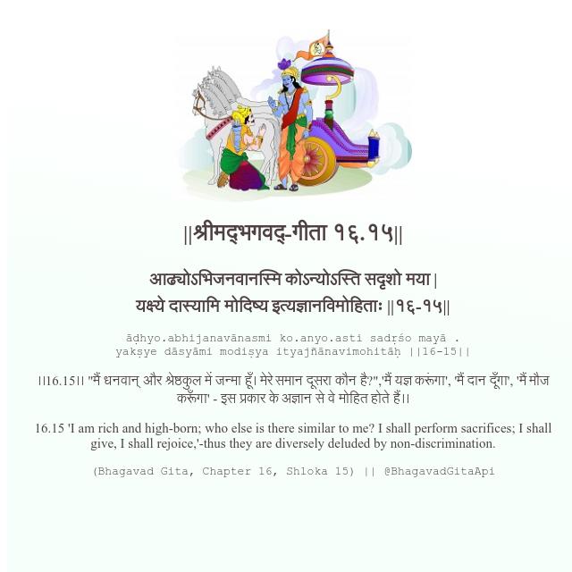

<h2>||श्रीमद्‍भगवद्‍-गीता १६.१५||</h2>
<h3>आढ्योऽभिजनवानस्मि कोऽन्योऽस्ति सदृशो मया | यक्ष्ये दास्यामि मोदिष्य इत्यज्ञानविमोहिताः ||१६-१५||</h3>
<pre>āḍhyo.abhijanavānasmi ko.anyo.asti sadṛśo mayā . yakṣye dāsyāmi modiṣya ityajñānavimohitāḥ ||16-15||</pre>

।।16.15।। "मैं धनवान् और श्रेष्ठकुल में जन्मा हूँ। मेरे समान दूसरा कौन है?",'मैं यज्ञ करूंगा', 'मैं दान दूँगा', 'मैं मौज करूँगा' - इस प्रकार के अज्ञान से वे मोहित होते हैं।।

<pre>(Bhagavad Gita, Chapter 16, Shloka 15) || @BhagavadGitaApi</pre>
https://docs.bhagavadgitaapi.in/

#API #bhagavadgitaapi #slok #nodejs #js #api #gitaapi #krishna #hinduism #vedic #ISKCON #shreemadbhagavadgita #technology

