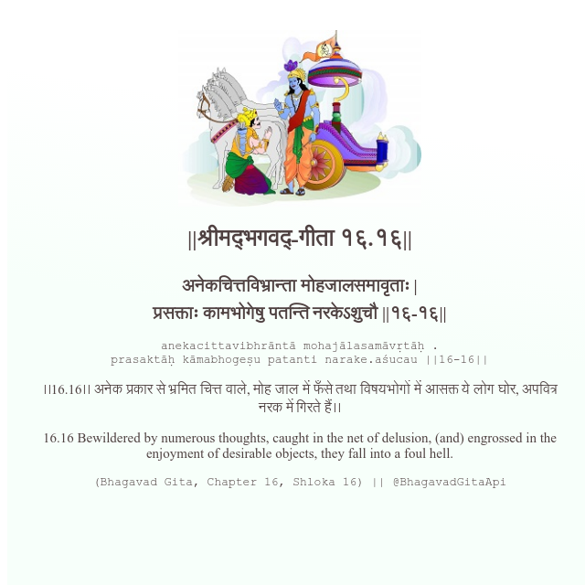

<h2>||श्रीमद्‍भगवद्‍-गीता १६.१६||</h2>
<h3>अनेकचित्तविभ्रान्ता मोहजालसमावृताः | प्रसक्ताः कामभोगेषु पतन्ति नरकेऽशुचौ ||१६-१६||</h3>
<pre>anekacittavibhrāntā mohajālasamāvṛtāḥ . prasaktāḥ kāmabhogeṣu patanti narake.aśucau ||16-16||</pre>

।।16.16।। अनेक प्रकार से भ्रमित चित्त वाले, मोह जाल में फँसे तथा विषयभोगों में आसक्त ये लोग घोर, अपवित्र नरक में गिरते हैं।।

<pre>(Bhagavad Gita, Chapter 16, Shloka 16) || @BhagavadGitaApi</pre>
https://vedicscriptures.github.io/

#API #bhagavadgitaapi #slok #nodejs #js #api #gitaapi #krishna #hinduism #vedic #ISKCON #shreemadbhagavadgita #technology

