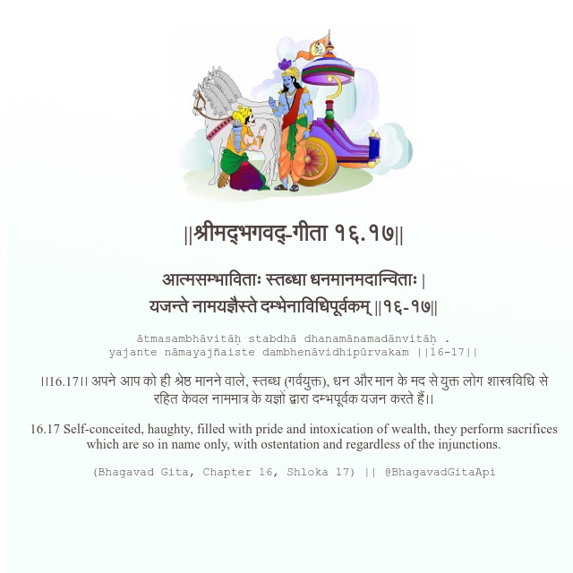

<h2>||श्रीमद्‍भगवद्‍-गीता १६.१७||</h2>
<h3>आत्मसम्भाविताः स्तब्धा धनमानमदान्विताः | यजन्ते नामयज्ञैस्ते दम्भेनाविधिपूर्वकम् ||१६-१७||</h3>
<pre>ātmasambhāvitāḥ stabdhā dhanamānamadānvitāḥ . yajante nāmayajñaiste dambhenāvidhipūrvakam ||16-17||</pre>

।।16.17।। अपने आप को ही श्रेष्ठ मानने वाले, स्तब्ध (गर्वयुक्त), धन और मान के मद से युक्त लोग शास्त्रविधि से रहित केवल नाममात्र के यज्ञों द्वारा दम्भपूर्वक यजन करते हैं।।

<pre>(Bhagavad Gita, Chapter 16, Shloka 17) || @BhagavadGitaApi</pre>
https://bhagavadgitaapi.in/

#API #bhagavadgitaapi #slok #nodejs #js #api #gitaapi #krishna #hinduism #vedic #ISKCON #shreemadbhagavadgita #technology

